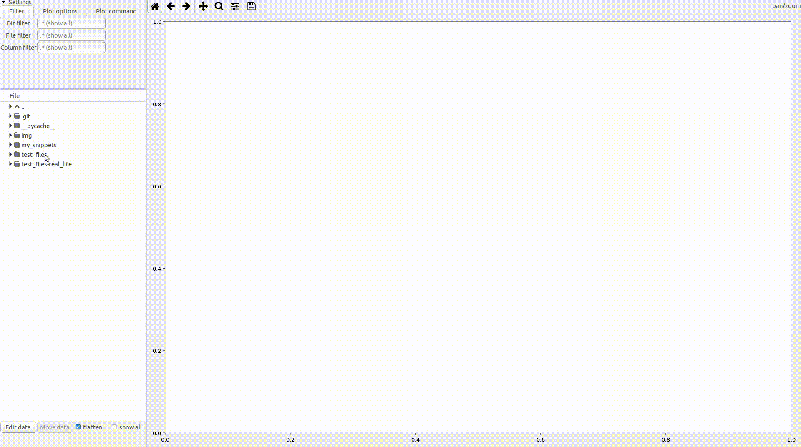

# nihilnovi - scientific data plotting program that tries to do nothing new

## Short description 
An efficient workflow for fast viewing and processing of scientific data. Tested in my daily work.

1. Browsing data is as easy as browsing a photo gallery. **Select files** in the left panel (hold ```Ctrl``` or ```Shift``` to select multiple files).
1. If you wish to change the plot style, look at the **plot gallery** and copy the relevant code into your own script in the upper left panel.
 Graphical options are determined by the **matplotlib library**, so that its [well-written documentation](http://matplotlib.org) and tricks apply.
1. Data preprocessing capabilities are infinite with [Python](https://www.python.org/)+[NumPy](http://www.numpy.org/) *et al.*. 
1. No matter how elaborate the processing & plotting routine is, new data can be added by few tricks. Saving the script, one can review it any time later. 
1. Using the diskette icon above the plot, you can export a publication-ready PNG or [PDF](./img/plot_gallery.pdf) -- literally in few seconds.



What nihilnovi does **not** do:
1. No new language, no new plotting library, no custom data format. Wonderful software for this already exists - let's use it fully. 
1. No graphical or mathematical options in the menu. For hard tasks, typing code is much more efficient than clicking. Simple tasks are fast to write anyway. Python programming is fun and learning it pays off.
1. No fees for the software. I made a tool needed for my work and I only wish to see positive evolution in the scientific community.

## Motivation 
Scientific work is often based on handling numerical or experimental results in a computer. With the currently available options, it  can become a somewhat frustrating task, which people solve in different ways. One can store the data in a **proprietary structured formats** of specialized software; perhaps the most popular being "[Origin](http://originlab.com/) projects" \*.opj. The trouble with this approach is in that it permanently restricts the author and all their collaborators to use one piece of proprietary software, with compatibility issues between its versions and without any guarantee of being able to access your results in 10 or 20 years.

Switching to  alternative **open-source structured formats**, such as [Scidavis](http://scidavis.sourceforge.net/), may present a compatibility barrier, since its interoperability with Origin has been still questionable. In either case, the workflow remains limited to the capabilities of the corresponding program. It is said that holding a hammer, one sees every problem as a nail; likewise, using a graphical application with fairly limited capabilities and almost no means of automatization, a scientist wrongly perceives many interesting problems either as desperately tedious or even untreatable. Aside of this, such applications force the user to accept one given point-and-click workflow which may be far from optimal, and do not allow attaching arbitrary files to the datasets. Also the quality of the plots is not always good.

A different approach is to store one's data as plain **text files** (**\*.dat** or **\*.csv**). Fairly complex operations then can be programmed using, e.g., Matlab, R, Python or other suitable language, and gigantic amounts of data can be processed in a single batch. However, it is inconvenient to repeatedly write own scripts even for simple operations -- such as plotting or curve fitting. Sometimes people store the data along with **image files** with their plots, but again, the repeated plotting can be tedious.

**NihilNovi** resolves this problem by allowing the user to **view plain text files** rendered immediately as plots.

## Installation 

#### Installation on Linux
1. On Linux, you may need to get its dependencies; e.g. for Ubuntu, run:

```	
sudo apt install python3-matplotlib python3-numpy python3-cairo python3-cairocffi python3-gi-cairo
```	

2. Then get the fresh version by pulling this project

```	
git clone http://github.com/filipdominec/nihilnovi.git
```	

3. And you can launch the program:

```	
cd nihilnovi
python3 nihilnovi.py
```

4. The support for origin files is optional, and it requires compilation:

```
# .OPJ - Origin files
sudo apt-get install -y cython3 doxygen cmake libboost-all-dev
#git clone https://github.com/Saluev/python-liborigin2.git ## did not support recent Origin9 files
git clone https://github.com/gbm19/python-liborigin2
cd python-liborigin2/
mkdir build
cd build
cmake ../
make
doxygen Doxyfile
cd ..
sudo python3 setup.py install
cd ..
```

#### Installation on Windows 10 using Anaconda

1. Get anaconda and install it following the [official guide](https://docs.anaconda.com/anaconda/install/windows/). Default settings are OK. 

2. Meanwhile, you can download the project as a ZIP file, unpack the files e.g. into ```nihilnovi-master\``` in your directory. Alternately, you may clone the repository using git if you prefer.

3. Once anaconda is installed, launch the *anaconda shell* from the system menu the following lines. You can use copy & paste.

```	
conda create nihilnovi
conda activate nihilnovi
conda install -c conda-forge pygobject numpy matplotlib gtk3 adwaita-icon-theme
```	

4. It will download ca. 160 MB of mostly useful (and some rather useless) dependencies. Then you should be able to run nihilnovi from the folder you unpacked it in:

```	
python nihilnovi-master\nihilnovi.py
```	

(Nihilnovi is python3-based. Note that this command actually runs python3, confusingly.)
	
[comment]: # read also: http://stackoverflow.com/questions/38475134/making-matplotlib-and-gtk3-work-on-python3-windows needs no be tested)
[comment]: # One day I will try to use [py2exe](http://py2exe.org/) to bundle all required dependencies into one package for Windows.

#### Installation on Windows 10 using Miniconda (preferred, but untested)
 
TODO: this will probably be analogous to Anaconda:

https://docs.conda.io/projects/conda/en/latest/user-guide/install/windows.html

```	
conda create nihilnovi
conda activate nihilnovi
conda install -c conda-forge pygobject numpy matplotlib scipy  gtk3 adwaita-icon-theme ## + other required packages
```	

Definitely a shortcut should be made https://pbpython.com/windows-shortcut.html

## Supported file formats
Examples of accessible file formats are in `test_files/`.

#### ASCII files (\*.csv, \*.dat and \*.txt)

Nihilnovi will try to understand all common formatting of files with comma- or whitespace-separated human-readable values.  A minimal example (in `test_files/doublecolumn_names.dat`) shows a single-line plot with correctly named axes:

	temperature(K)		conductivity(uS)
	1					40
	2					40
	4					44
    (...)

Parsing of all such files is provided by the `robust_csv_parser.py` module, which is described below in more detail. 


#### Origin files (\*.opj)

Origin files are containers for multiple data files. In Nihilnovi, such a file is represented in the same way as a directory: Its row can be expanded to show all contained spreadsheets, which can be further expanded to enable plotting all respective data columns. It was, however, observed that with some files, the external origin parser causes a memory leak or crashes.

Additionally, Origin saves presentation-ready graphs that refer to one or more data columns. 

#### Future dependencies

In the future, browsing of other types files will probably bring also following dependencies:

    ## .HDF5 - Hierarchical data format
    sudo apt-get install python3-h5py
    
	## .XLS - Excel files (and what about .ODS?)
    sudo apt-get install python3-xlrd


#### HDF - Hierarchical data format (\*.h5)

*not implemented yet*

Also HDF files are containers that should be seamlessly accessible like a directory.

#### MS Excel and OpenOffice Calc spreadsheets (\*.xls, \*.xlsx and \*.ods)

*not implemented yet*

Using the Excel and Calc conversion libraries, NihilNovi will also enable browsing the spreadsheets of such files. Each spreadsheet will be treated like a tab-separated ASCII text file, so the rules for this kind of files apply. 

#### Other formats

*not implemented yet*

Since many vendors of scientific software and hardware seem to enjoy inventing their own syntax of data files, it might be useful to add a simple interface for additional user-supplied parsers.


## Reusable parts of the code (which may be useful for other projects)
#### Robust CSV parser
The python module `robust_csv_parser.py` is maybe the most flexible ASCII data parser available, attempting to use as much heuristics for data file interpretation as a human would do. Its main function `loadtxt()` can be used as a replacement for `numpy.loadtxt()`, `numpy.genfromtxt()`, `csv.read()` or `pandas.loadtable()` whenever the formatting of the input files is not a priori known.

Its features include:
 * It adapts to different column delimiters (comma, single tabulator, any single whitespace, or a group of whitespaces), attempting to find all numeric columns while maintaining the shape of the loaded data table close to rectangle. This way it can cope not only with files containing aligned columns (i.e. values padded by whitespace), but it can also tolerate a reasonably small number of missing values. The missing fields are then simply left out as gaps in the respective plots. (see, e.g., `test_files/triplecolumn.dat`)
 * It tries to find a header containing the column names; its line may or may not be commented out. If the number of header entries is one less than detected column numbers, it is assumed that the header omits the ordinate, which is automatically names as `x`. If no header detected, all columns are named automatically. 
 * Since whitespace in the header is often reserved as a separator of its entries, the module tries to restore nice-looking names of columns: e.g. it converts `powerConsumedDaily(kWh)` to `power consumed daily (kWh)`.
 * Some data files contain arbitrary parameters in the form similar to `name=value`, format of which however differs.  The module expects all commented-out lines containing `=`, `:`, `\t+`, `,` to contain parameters, and for the most obvious case of `=` sign, it does not require the line to be a comment. The detected parameters are returned as a dictionary.
 * Comment lines (i.e. lines starting with  `#`, `!`, `;`, `,` or `%`) are skipped. Also comments from the ends of lines (everything after the `#` character) are removed before parsing.
 * Invalid data (empty cell of a column, `NaN`, strings instead of numbers etc.) do not break the parsing; the module attempts to extract as much data as possible.

#### Alpha-numeric sorting of files
Usual sorting algorithms do not care much about the numerical values embedded in a string.
This means e.g. that 'temperature-12' may wrongly come after 'temperature12', or '12200fish' will in 
most cases come after '0.123E+05fish'. For sequential plotting and processing of multiple files containing scientific data, this is not satisfactory.

The `sort_alpha_numeric.py` module offers the `sort_alpha_numeric()` function which accepts a list of strings. For each of them,
it uses a regular expression to split it into a sub-list of interleaved non-numeric and numeric sections, the 
latter being converted to true float numbers. Then, the proper order of these sub-lists can be efficiently found, 
and the original names are returned. 

To test the intelligent alpha-numeric sorting, try to call it add arguments as such:

    python3 sort_alpha_numeric.py xx-123.4zz xx-1.233e+002yy xx-123.2yy xx-123.4yy

to obtain a correctly sorted list of `'xx-123.4yy', 'xx-123.4zz', 'xx-1.233e+002yy', 'xx-123.2yy'`


## PAQ - presumably asked questions
#### Q: Will this work on Windows?
A: The choice of Python3+Matplotlib+GTK3 dependencies was made with Windows compatibility in mind, but we will have to test it out.

#### Q: The application freezes when opening an OPJ file saved by Origin 9 or newer
A: Yes, this is a known issue of the `liborigin2` library; it is going to be replaced either by [importOPJ](https://svn.code.sf.net/p/scidavis/svn/branches/origin_import/importOPJ/README) or by [kaitai](https://github.com/kaitai-io/kaitai_struct) parser.

#### Q: Can I plot other styles of graphs than just lines and contours? -- or -- Can I change the plot labels and title?
A: Yes, you can switch to the _Plot command_ tab and write a custom Python3+Matplotlib code for plotting. 

#### Q: Can I export the plot for publication?
A: Sure, there is a diskette icon above the plot window; you can choose between PDF, PNG, JPG, SVG and other formats to export.

#### Q: I have several folders, and wish to compare one file from each of them
A: First type a part of the file name in the _File filter_ entry, so that this file is the only one that is shown when the folders are unpacked. Then, holding the _shift_ key, click the _last_ folder, and click the _first_ folder. All folders between them should unpack, comparing the desired files. Note you can also use the _Column filter_, likewise.

#### Q: I have found an ASCII/CSV format that can not be opened by the built-in parser
A: Then I am interested in getting a minimum non-working example, and will try to adapt the parser to work with it!


