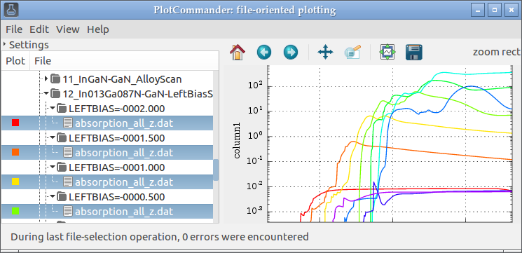

### Short description 
A lightweight application allowing to browse data files on your disk, and see their contents immediately plotted in the right panel.

Key points:
 * [x] Data file viewing, comparison and other simple tasks should be **as easy as browsing one's photo gallery**
 * [ ] Data preprocessing should **allow the flexibility of writing standalone scripts** in *[Python](https://www.python.org/)*+*[NumPy](http://www.numpy.org/)*
 * [ ] Plot options are determined by the **matplotlib library**, so that its [well-written documentation](http://matplotlib.org) and tricks apply. Settings can be also stored as python scripts.
 * [ ] **Program code is kept short** and as clean as possible to enable its reuse in other projects
 * [ ] Define **keyboard shortcuts** for all important functions. While easy to learn, mouse control of a program is slow. 
 * [x] **Promote open data formats** in research for easier cooperation, safer archivation and more efficient work. Rely on open-source libraries and make the program multi-platform.

### Motivation 
Scientific work is often based on handling numerical or experimental results in a computer. With the currently available options, it  can become a somewhat frustrating task, which people solve in different ways. One can store the data in a **proprietary structured formats** of specialized software; perhaps the most popular being "[Origin](http://originlab.com/) projects" \*.opj. The trouble with this approach is in that it permanently restricts the author and all their collaborators to use one piece of proprietary software, with compatibility issues between its versions and without any guarantee of being able to access your results after 10 or 20 years.

Switching to  alternative **open-source structured formats**, such as [Scidavis](http://scidavis.sourceforge.net/), may present a compatibility barrier, since its interoperability with Origin has been still questionable. In either case, the workflow remains limited to the capabilities of the corresponding program. It is said that holding a hammer, one sees every problem as a nail; likewise, using a graphical application with fairly limited capabilities and almost no means of automatization, a scientist wrongly perceives many interesting problems either as desperately tedious or even untreatable. Aside of this, such applications force the user to accept one given point-and-click workflow which may be far from optimal, and do not allow attaching arbitrary files to the datasets. Also the quality of the plots is not always good.

A different approach is to store one's data as plain **text files** (**\*.dat** or **\*.csv**). Fairly complex operations then can be programmed using, e.g., Matlab, R, Python or other suitable language, and gigantic amounts of data can be processed in a single batch. However, it is inconvenient to repeatedly write own scripts even for simple operations -- such as plotting or curve fitting. Sometimes people store the data along with **image files** with their plots, but again, the repeated plotting can be tedious.

**PlotCommander** resolves this problem by allowing the user to **view plain text files** rendered immediately as plots.

### Installation 

On Linux, you may need to get its dependencies; e.g. for Ubuntu 15.04/16.04, run:

    sudo apt-get install python3-matplotlib python3-numpy python3-gi-cairo

The support for origin files is optional, since it requires compilation:

	## .OPJ - Origin files
	sudo apt-get install -y cython3 doxygen cmake libboost-all-dev
	git clone https://github.com/Saluev/python-liborigin2.git
	cd python-liborigin2/
	mkdir build
	cd build
	cmake ../
	make
	doxygen Doxyfile
	cd ..
	sudo python3 setup.py install
	cd ..

Then get the fresh version by pulling this project, and launch the program directly:

    git clone http://github.com/filipdominec/plotcommander.git
    cd plotcommander
    python3 plotcommander.py

#### Future dependencies

In the future, browsing of other types files will probably bring also following dependencies:

    ## .HDF5 - Hierarchical data format
    sudo apt-get install python3-h5py
    
	## .XLS - Excel files (and what about .ODS?)
    sudo apt-get install python3-xlrd

On Windows, the proposed distribution approach will be to use [py2exe](http://py2exe.org/) to bundle all required dependencies into one package.

### Supported file formats
Examples of accessible file formats are in `test_files/`.

#### ASCII files (\*.csv, \*.dat and \*.txt)

PlotCommander will try to understand all common formatting of files with comma- or whitespace-separated human-readable values.  A minimal example (in `test_files/doublecolumn_names.dat`) shows a single-line plot with correctly named axes:

	temperature(K)		conductivity(uS)
	1					40
	2					40
	4					44
    (...)

Parsing of all such files is provided by the `robust_csv_parser.py` module, which is described below in more detail. 

#### Origin files (\*.opj)

Origin files are containers for multiple data files. In PlotCommander, such a file is represented in the same way as a directory: Its row can be expanded to show all contained spreadsheets, which can be further expanded to enable plotting all respective data columns. It was, however, observed that with some files, the external origin parser causes a memory leak or crashes.

Additionally, Origin saves presentation-ready graphs that refer to one or more data columns. 

#### HDF - Hierarchical data format (\*.h5)

*not implemented yet*

Also HDF files are containers that should be seamlessly accessible like a directory.

#### MS Excel and OpenOffice Calc spreadsheets (\*.xls, \*.xlsx and \*.ods)

*not implemented yet*

Using the Excel and Calc conversion libraries, PlotCommander will also enable browsing the spreadsheets of such files. Each spreadsheet will be treated like a tab-separated ASCII text file, so the rules for this kind of files apply. 

#### Other formats

*not implemented yet*

Since many vendors of scientific software and hardware seem to enjoy inventing their own syntax of data files, it might be useful to add a simple interface for additional user-supplied parsers.

### Reusable parts of the code (which may be useful for other projects)
#### Robust CSV parser
The python module `robust_csv_parser.py` is maybe the most flexible ASCII data parser available, attempting to use as much heuristics for data file interpretation as a human would do. Its main function `loadtxt()` can be used as a replacement for `numpy.loadtxt()`, `numpy.genfromtxt()`, `csv.read()` or `pandas.loadtable()` whenever the formatting of the input files is not a priori known.

Its features include:
 * It adapts to different column delimiters (comma, single tabulator, any single whitespace, or a group of whitespaces), attempting to find all numeric columns while maintaining the shape of the loaded data table close to rectangle. This way it can cope not only with files containing aligned columns (i.e. values padded by whitespace), but it can also tolerate a reasonably small number of missing values. The missing fields are then simply left out as gaps in the respective plots. (see, e.g., `test_files/triplecolumn.dat`)
 * It tries to find a header containing the column names; its line may or may not be commented out. If the number of header entries is one less than detected column numbers, it is assumed that the header omits the ordinate, which is automatically names as `x`. If no header detected, all columns are named automatically. 
 * Since whitespace in the header is often reserved as a separator of its entries, the module tries to restore nice-looking names of columns: e.g. it converts `powerConsumedDaily(kWh)` to `power consumed daily (kWh)`.
 * Some data files contain arbitrary parameters in the form similar to `name=value`, format of which however differs.  The module expects all commented-out lines containing `=`, `:`, `\t+`, `,` to contain parameters, and for the most obvious case of `=` sign, it does not require the line to be a comment. The detected parameters are returned as a dictionary.
 * Comment lines (i.e. lines starting with  `#`, `!`, `;`, `,` or `%`) are skipped. Also comments from the ends of lines (everything after the `#` character) are removed before parsing.
 * Invalid data (empty cell of a column, `NaN`, strings instead of numbers etc.) do not break the parsing; the module attempts to extract as much data as possible.

#### Alpha-numeric sorting of files
Usual sorting algorithms do not care much about the numerical values embedded in a string.
This means e.g. that 'temperature-12' may wrongly come after 'temperature12', or '12200fish' will in 
most cases come after '0.123E+05fish'. For sequential plotting and processing of multiple files containing scientific data, this is not satisfactory.

The `sort_alpha_numeric.py` module offers the `sort_alpha_numeric()` function which accepts a list of strings. For each of them,
it uses a regular expression to split it into a sub-list of interleaved non-numeric and numeric sections, the 
latter being converted to true float numbers. Then, the proper order of these sub-lists can be efficiently found, 
and the original names are returned. 

To test the intelligent alpha-numeric sorting, try to call it add arguments as such:

    python3 sort_alpha_numeric.py xx-123.4zz xx-1.233e+002yy xx-123.2yy xx-123.4yy

to obtain a correctly sorted list of `'xx-123.4yy', 'xx-123.4zz', 'xx-1.233e+002yy', 'xx-123.2yy'`

### PAQ - presumably asked questions
#### Q: 

### To-Do 

 * [ ] add kb shortcuts - e.g. ctrl+w to close app, Matplotlib operations on the plot, ...
 * [ ] allow selecting curves in the plot panel, too
 * [ ] data manipulation operations (shift x/y, zoom x/y, fit linear/gaussian/sine), file saving
 * [ ] when parameters encoded in file name: intelligent extraction of the changing parameter
 * [ ] multiple columns in files --> subfigures
 * [ ] merge functions from python-meep-utils:multiplot.py
 * [ ] enable browsing HDF5 files if libhdf available (dtto)
 * [ ] plotcommander.py RC files should be searched for in the directory (and all updirs, too)
 * [ ] try porting GtkSourceView to python3 
 * [ ] trace the memleaks and errors in the liborigin code
 * [ ] could http://www.originlab.com/doc/Orglab/Orglab be used for anything?
 * [ ] examine the reason for persistent ValueError("posx and posy should be finite values") when browsing plots
 * [ ] fix statusbar - direct response when loading files
 * [ ] plotrc autosave before plotting
 * [ ] avoid following symlinks (or at least catch OSError)
 * [ ] new feature: automatic guessing of the swept parameter
 * [x] when file filter is changed/disabled, the selected files are slowly, sequentially replotted. Disable onselect action when restoring the selection!
 * [ ] robust_csv_parser.py", line 70, nests FileNotFoundError
